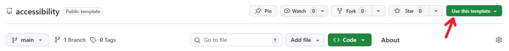

# LaTeX Beamer Accessibility Template

**NOTE**: Please do not fork. Create a new template. 
> 

This is a simple template to make your LaTeX Beamer slides accessible (tagged document structure, etc.)

You need `lualatex` to compile it. You need the latest version of `texlive` (I had to upgrade my Ubuntu distribution to the latest LTS: 24.04.3).

```lualatex beamer.tex```

You can redefine some beamer commands to avoid manually tagging.

```
%redefine macros to add tag
\let\oldframetitle\frametitle
\renewcommand{\frametitle}[1]{
  \tagstructbegin{tag=H1}
         \oldframetitle{#1}
  \tagstructend
}
```

You can check how it works, and easily adapt to regular LaTeX documents (e.g., redefine `\section` to tag it as H1). This way, you only need to edit the preamble.

